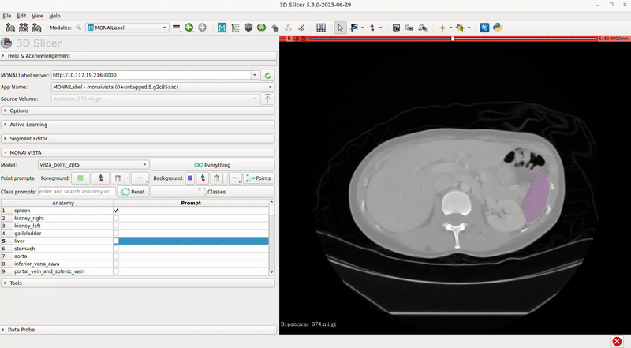
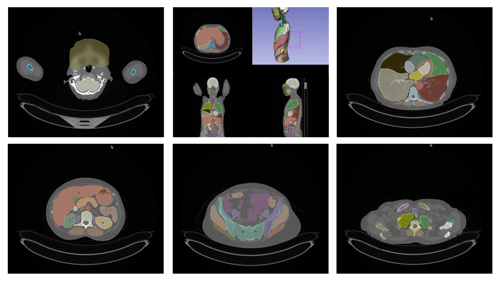
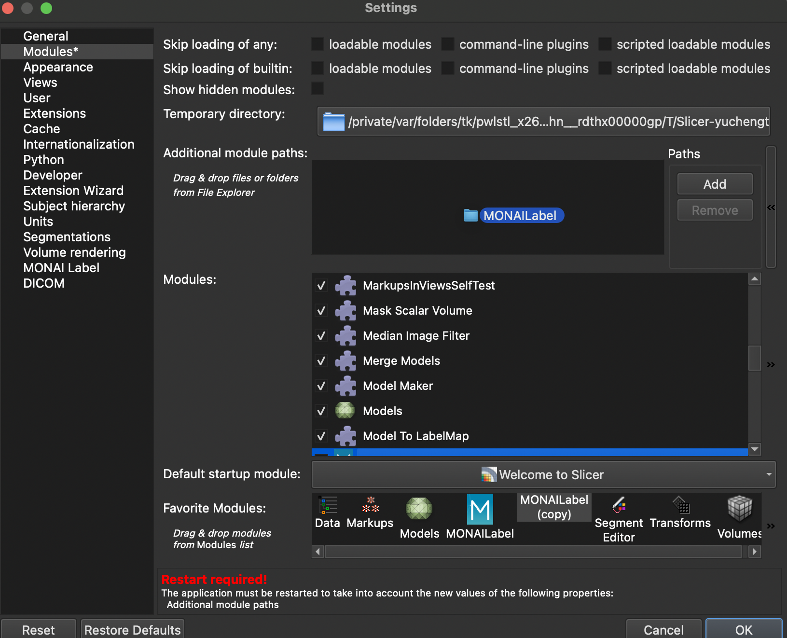
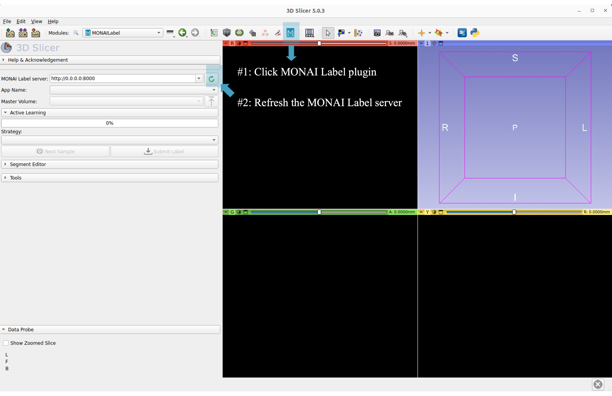
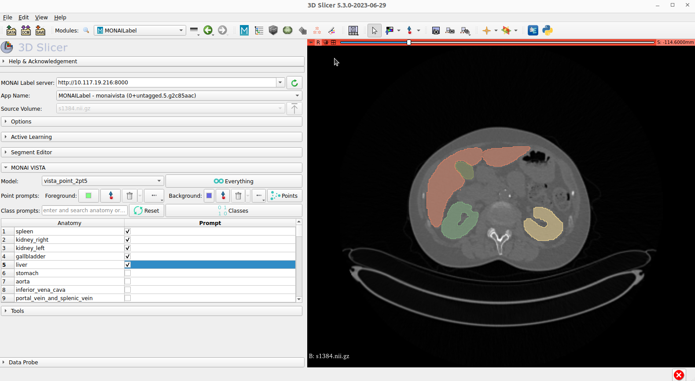

<!--
Copyright (c) MONAI Consortium
Licensed under the Apache License, Version 2.0 (the "License");
you may not use this file except in compliance with the License.
You may obtain a copy of the License at
    http://www.apache.org/licenses/LICENSE-2.0
Unless required by applicable law or agreed to in writing, software
distributed under the License is distributed on an "AS IS" BASIS,
WITHOUT WARRANTIES OR CONDITIONS OF ANY KIND, either express or implied.
See the License for the specific language governing permissions and
limitations under the License.
-->

# MONAI VISTA

MONAI **V**ersatile **I**maging **S**egmen**T**ation and **A**nnotation

<div align="center">  </div>

### Table of Contents
- [Overview](#overview)
- [MONAI VISTA Training and FineTuning](training/)
- [MONAI VISTA with MONAI Label](#monai-label-integration)
  - [Step 1. Installation](#installation)
  - [Step 2. MONAI Label monaivista app](#monai-vista-app)
  - [Step 3. MONAI VISTA - Label Plugins](#monai-vista-viewer-plugins)
  - [Step 4. Data Preparation](#sample-data)
  - [Step 5. Start MONAI Label Server and Start Annotating!](#start-monai-label-server-with-vista-model)
- [Video Demo](https://drive.google.com/file/d/1rEF1y9ZKo3Kj0Zms_gxkKwHlz75CYjwA/view?usp=sharing)
- [Community](#community)
- [License](#license)
- [Reference](#reference)

## Overview

[MONAI Meetup presentation at MIDL 2023](https://docs.google.com/presentation/d/1evp8txCyTzkqLT0fVE_0eFlXL4hux5myb7ggFhokRFQ)

MONAI VISTA provides domain-specific workflows for building and utilizing foundation models
for medical image segmentation.
It leverages state-of-the-art deep learning technology to establish a
new collaborative approach for developing robust and versatile
 segmentation models and applications.

This repository hosts the ongoing effort of building MONAI VISTA and
is currently under active development.

<div align="center">  </div>


## MONAI Label Integration
This section provides MONAI Label integration and sample apps. The integration is a server-client
system that facilitates interactive medical image segmentation using VISTA via the sample 3D slicer plugin.

### Installation

MONAI VISTA models are integrated based on [MONAI Label](https://docs.monai.io/projects/label/en/latest/index.html#).
Start using MONAI Label locally and run the installation with your familiar visualization tools.
Stable version software represents the currently tested and supported visualization tools with
the latest release of MONAI Label.

Refer to [MONAI Label installation](https://docs.monai.io/projects/label/en/latest/installation.html) page
for details. For milestone releases, users can install from PyPl with the command:

```bash
pip install monailabel

```

For Docker and Github installation, refer to MONAI Label [Github](https://github.com/Project-MONAI/MONAILabel)

### MONAI VISTA APP

Based on MONAI Label, MONAI VISTA is developed as an app. This app has example models
to do both interactive and "Everything" segmentation over medical images.
Prompt-based segment experience is highlighted. Including class prompts and point click prompts, Segmentation with the latest deep learning architectures (e.g., Segmentation Anything Model (SAM)) for multiple lung, abdominal, and pelvis
organs. Interactive tools include control points and class prompt check boxes developed with viewer plugins.

Get the monaivista app with:

```bash
# Clone MONAI VISTA repo
git clone git@github.com:Project-MONAI/VISTA.git
# the sample monaivista app is in the monailabel folder
cd VISTA/monailabel
```

For more details on `monaivista` app, see the [sample-app page](https://github.com/Project-MONAI/VISTA/tree/main/monailabel/monaivista).

### MONAI VISTA Viewer Plugins

The interactive annotation experience with prompt-based segmentation models needs the integration of medical image viewers.
MONAI VISTA and MONAI Label support multiple open-sourced viewers, such as [3D Slicer](https://www.slicer.org/) and [OHIF](https://ohif.org/).

Example of 3D Slicer integration:

3D Slicer is a free, open-source software for visualization, processing, segmentation, registration,
and other 3D images and meshes. 3D Slicer is a mature and well-tested viewer for radiology studies and algorithms.

#### Installing 3D Slicer

To use MONAI Label with 3D Slicer, you'll need to download and install 3D Slicer.
MONAI Label supports stable and preview versions of 3D Slicer, version 5.0 or higher.
For more information on installing 3D Slicer,
check out the [3D Slicer Documentation](https://slicer.readthedocs.io/en/latest/user_guide/getting_started.html#installing-3d-slicer)

#### Install MONAI VISTA-Label plugin of 3D Slicer

The plugin needs to be added in developer mode. Please follow the below steps.

##### Plugin in Developer Mode

- `git clone git@github.com:Project-MONAI/VISTA.git`
- Find the plugin folder: `plugins/slicer/MONAILabel`
- Open 3D Slicer: Go to **Edit** -> **Application Settings** -> **Modules** -> **Additional Module Paths**
- Add New Module Path: _<FULL_PATH>_/plugins/slicer/MONAILabel (You can drag the slicer/MONAILabel folder to the module panel.)
- _**Restart**_ 3D Slicer

<div align="center">  </div>

<div align="center">  </div>

### Sample Data

Prepare some sample data to start with:

Download MSD pancreas dataset as the sample dataset using monailabel API.
The task is the volumetric (3D) segmentation of the pancreas from CT image.
The dataset is from the 2018 MICCAI challenge.

```bash
monailabel datasets --download --name Task07_Pancreas --output .
```

### Start MONAI Label Server with VISTA Model

Specify the sample app and sample datasets' path in the following command:

```bash
monailabel start_server --app monaivista --studies ./Task07_Pancreas/imagesTs --conf models vista_point_2pt5
```

- Open 3D Slicer and MONAI VISTA-Label plugin.
<div align="center">  </div>

- Connect to the monailabel server, start annotating!
<div align="center">  </div>

## Community

Join the conversation on Twitter [@ProjectMONAI](https://twitter.com/ProjectMONAI) or join
our [Slack channel](https://projectmonai.slack.com/archives/C031QRE0M1C).

Ask and answer questions on [MONAI VISTA's GitHub discussions tab](https://github.com/Project-MONAI/VISTA/discussions).

## License

The model is licensed under the Apache 2.0 license.

## Reference

The current model is trained and developed based on [Segment Anything Model (SAM)](https://github.com/facebookresearch/segment-anything). Check the 3rd party license for reference.

We greatly appreciate the authors of [`Segment Anything`](https://github.com/facebookresearch/segment-anything) and [`TotalSegmentator`](https://github.com/wasserth/TotalSegmentator) for releasing their work under a permissive license to the community.

```
@article{kirillov2023segany,
      title={Segment Anything},
      author={Kirillov, Alexander and Mintun, Eric and Ravi, Nikhila and Mao, Hanzi and Rolland, Chloe and Gustafson, Laura and Xiao, Tete and Whitehead, Spencer and Berg, Alexander C. and Lo, Wan-Yen and Doll{\'a}r, Piotr and Girshick, Ross},
      journal={arXiv:2304.02643},
      year={2023}
    }
@article{wasserthal2022totalsegmentator,
      title={TotalSegmentator: robust segmentation of 104 anatomical structures in CT images},
      author={Wasserthal, Jakob and Meyer, Manfred and Breit, Hanns-Christian and Cyriac, Joshy and Yang, Shan and Segeroth, Martin},
      journal={arXiv preprint arXiv:2208.05868},
      year={2022}
    }
```

This integration is based on MONAI Label:

```bash
@article{diaz2022monai,
  title={Monai label: A framework for ai-assisted interactive labeling of 3d medical images},
  author={Diaz-Pinto, Andres and Alle, Sachidanand and Nath, Vishwesh and Tang, Yucheng and Ihsani, Alvin and Asad, Muhammad and P{\'e}rez-Garc{\'\i}a, Fernando and Mehta, Pritesh and Li, Wenqi and Flores, Mona and others},
  journal={arXiv preprint arXiv:2203.12362},
  year={2022}
}
```
