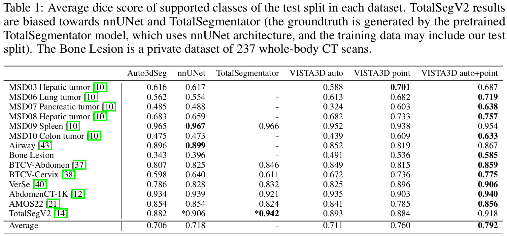
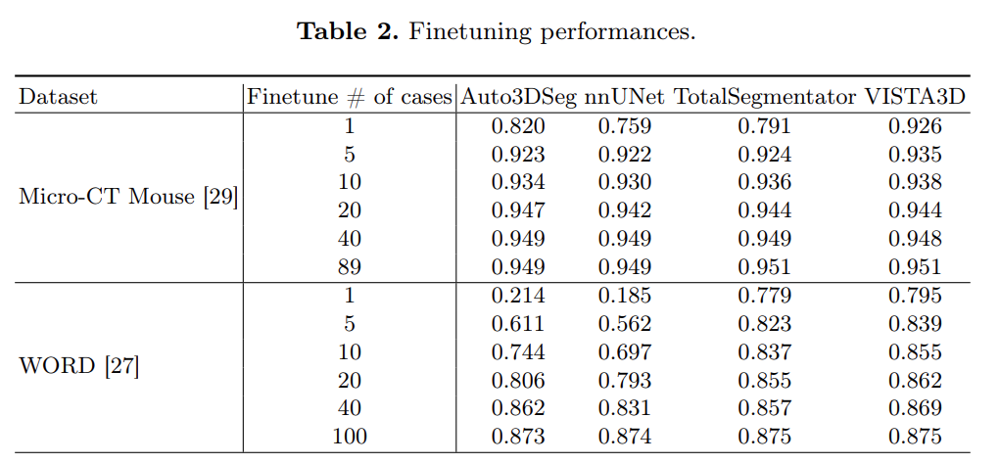

<!--
Copyright (c) MONAI Consortium
Licensed under the Apache License, Version 2.0 (the "License");
you may not use this file except in compliance with the License.
You may obtain a copy of the License at
    http://www.apache.org/licenses/LICENSE-2.0
Unless required by applicable law or agreed to in writing, software
distributed under the License is distributed on an "AS IS" BASIS,
WITHOUT WARRANTIES OR CONDITIONS OF ANY KIND, either express or implied.
See the License for the specific language governing permissions and
limitations under the License.
-->

# MONAI **V**ersatile **I**maging **S**egmen**T**ation and **A**nnotation
[[`Paper`](https://arxiv.org/pdf/2406.05285)] [[`Demo`](https://build.nvidia.com/nvidia/vista-3d)] [[`Container`](https://docs.nvidia.com/ai-enterprise/nim-medical-imaging/latest/vista-3d.html)] 
## Overview

The **VISTA3D** is a foundation model trained systematically on 11454 volumes encompassing 127 types of human anatomical structures and various lesions. It provides accurate out-of-the-box segmentation that matches state-of-the-art supervised models which are trained on each dataset. The model also achieves state-of-the-art zero-shot interactive segmentation in 3D, representing a promising step toward developing a versatile medical image foundation model.
<div align="center">  </div>

### Out-of box automatic segmentation
For supported 127 classes, the model can perform highly accurate out-of-box automatic segmentation ('VISTA3D auto' in Table.1). The automatic segmentation is using patch-based sliding-window inference and is designed using `class prompt`.
Compared to nnUNet and auto3dseg, which are trained on each dataset separately, VISTA3D showed comparable out-of-box performances and strong generalizability. 
<!-- <div align="center">  </div> -->

### Refine auto-results with interactive editing
The interactive segmentation is based on 3D click points. Each click point will crop a 3D patch and the inference is performed on the patch. User can refine the automatic results with clicks ('VISTA3D auto+point' in Table.1). The single-click only results are also shown as 'VISTA3D point'. 
<!-- <div align="center">  </div> -->

### Zero-shot interactive segmentation
A major feature of VISTA3D is its zero-shot ability. VISTA3D can perform state-of-the-art 3D interactive segmentation on unseen classes. It usually takes more click points than supported classes. 

### Fine-tuning
VISTA3D checkpoint showed improvements when finetuning in few-shot settings. Once a few annotated examples are provided, user can start finetune with the VISTA3D checkpoint. 
<div align="center">  </div>

## Usage

### Installation
The code requires `monai>=1.3`. Download the [model checkpoint](xxxx) and save it at ./models/model.pt. 


### Inference
We support multiple inference methods. We optimized and standardized the VISTA3D model into the [monai bundle](), but the bundle does not contain user interface and might be difficult for interactive segmentation. We build an online [NVIDIA Inference Microservices (NIM)]() as the interface, which is using monai bundle as backend. Users are encouraged to try the model online on NIM. 

Another way is to use `infer.py` in the repository. We provide a simple local-running user interface `gui.py` that's using `infer.py` as backend, which can run on a 12GB GPU. Note we will priotize the updates of [NIM]() and the [monai bundle]() updates.  
```
python -m scripts.gui run
```

### Training
#### Dataset and SuperVoxel Curation
All dataset must contain a json data list file. We provide the json lists for all our training data in `data/jsons`. More details can be found [here](./data/README.md). For datasets used in VISTA3D training, we already included the json splits and registered their data specific label index to the global index as [label_mapping](./data/jsons/label_mappings.json) and their data path coded in `./data/datasets.py`. The supported global class index is defined in [label_dict](./data/jsons/label_dict.json). To generate supervoxels, refer to the [instruction](./data/README.md).
#### Execute training
VISTA3D has four stages training. The configurations represents the training procedure but may not fully reproduce the weights of VISTA3D since each stage has multiple rounds with slightly varying configuration changes. 
```
export CUDA_VISIBLE_DEVICES=0; python -m scripts.train run --config_file "['configs/train/hyper_parameters_stage1.yaml']"
```

Execute multi-GPU model training (the codebase also supports multi-node training):

```
export CUDA_VISIBLE_DEVICES=0,1,2,3,4,5,6,7;torchrun --nnodes=1 --nproc_per_node=8 -m scripts.train run --config_file "['configs/train/hyper_parameters_stage1.yaml']" 
```
### Evaluation
We provide code for supported class fully automatic dice score evaluation (val_multigpu_point_patch), point click only (val_multigpu_point_patch), and auto + point (val_multigpu_autopoint_patch). 

```
export CUDA_VISIBLE_DEVICES=0,1,2,3,4,5,6,7;torchrun --nnodes=1 --nproc_per_node=8 -m scripts.validation.val_multigpu_point_patch run --config_file "['configs/supported_eval/infer_patch_auto.yaml']" --dataset_name 'xxxx' 

export CUDA_VISIBLE_DEVICES=0,1,2,3,4,5,6,7;torchrun --nnodes=1 --nproc_per_node=8 -m scripts.validation.val_multigpu_point_patch run --config_file "['configs/supported_eval/infer_patch_point.yaml']" --dataset_name 'xxxx' 

export CUDA_VISIBLE_DEVICES=0,1,2,3,4,5,6,7;torchrun --nnodes=1 --nproc_per_node=8 -m scripts.validation.val_multigpu_autopoint_patch run --config_file "['configs/supported_eval/infer_patch_autopoint.yaml']" --dataset_name 'xxxx' 
```
For zero-shot, we perform iterative point sampling. To create a new zero-shot evaluation dataset, user only need to change `label_set` in the json config to match the class indexes in the original groundtruth. 
```
export CUDA_VISIBLE_DEVICES=0,1,2,3,4,5,6,7;torchrun --nnodes=1 --nproc_per_node=8 -m scripts.validation.val_multigpu_point_iterative run --config_file "['configs/zeroshot_eval/infer_iter_point_hcc.yaml']" 
```
### Finetune
For finetuning, user need to change `label_set` and `mapped_label_set` in the json config, where `label_set` matches the index values in the groundtruth files. The `mapped_label_set` can be random selected but we recommend pick the most related global index defined in [label_dict](./data/jsons/label_dict.json). User should modify the transforms, resolutions, patch sizes e.t.c regarding to their dataset for optimal finetuning performances, we recommend using configs generated by auto3dseg. The learning rate 5e-5 should be good enough for finetuning purposes. 
```
export CUDA_VISIBLE_DEVICES=0,1,2,3,4,5,6,7;torchrun --nnodes=1 --nproc_per_node=8 -m scripts.train_finetune run --config_file "['configs/finetune/train_finetune_word.yaml']" 
```


## Community

Join the conversation on Twitter [@ProjectMONAI](https://twitter.com/ProjectMONAI) or join
our [Slack channel](https://projectmonai.slack.com/archives/C031QRE0M1C).

Ask and answer questions on [MONAI VISTA's GitHub discussions tab](https://github.com/Project-MONAI/VISTA/discussions).

## License

The codebase is under Apache 2.0 Licence.

## Reference

```
@article{kirillov2023segany,
      title={VISTA3D: Versatile Imaging SegmenTation and Annotation model for 3D Computed Tomography},
      author={Yufan He, Pengfei Guo, Yucheng Tang, Andriy Myronenko, Vishwesh Nath, Ziyue Xu, Dong Yang, Can Zhao, Benjamin Simon, Mason Belue, Stephanie Harmon, Baris Turkbey, Daguang Xu, Wenqi Li},
      journal={arXiv:2406.05285},
      year={2024}
    }
```
