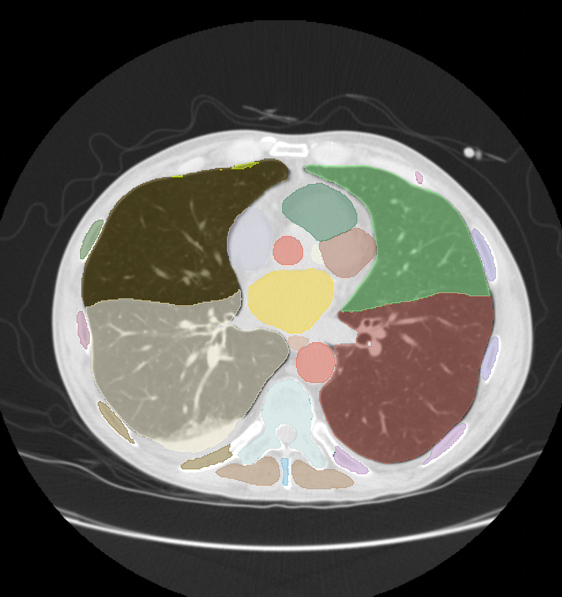

<!--
Copyright (c) MONAI Consortium
Licensed under the Apache License, Version 2.0 (the "License");
you may not use this file except in compliance with the License.
You may obtain a copy of the License at
    http://www.apache.org/licenses/LICENSE-2.0
Unless required by applicable law or agreed to in writing, software
distributed under the License is distributed on an "AS IS" BASIS,
WITHOUT WARRANTIES OR CONDITIONS OF ANY KIND, either express or implied.
See the License for the specific language governing permissions and
limitations under the License.
-->

# MONAI VISTA Models 

### Table of Contents
- [Overview](#Overview)
  - [Highlights and Features](#Highlights-and-Features)
- [Getting Started with MONAI Label](#Getting-Started-with-MONAI-Label)
  - [Step 1. Installation](#Step-1-Installation)
  - [Step 2. MONAI Label monaivista app](#Step-2-MONAI-Label-Sample-Applications)
  - [Step 3. MONAI Label Supported Viewers](#Step-3-MONAI-Label-Supported-Viewers)
  - [Step 4. Data Preparation](#Step-4-Data-Preparation)
  - [Step 5. Start MONAI Label Server and Start Annotating!](#Step-5-Start-MONAI-Label-Server-and-Start-Annotating)
- [Tutorials](#MONAI-Label-Tutorials)
- [Contributing](#Contributing)
- [Community](#Community)

## Overview

## MONAI Label Integration

