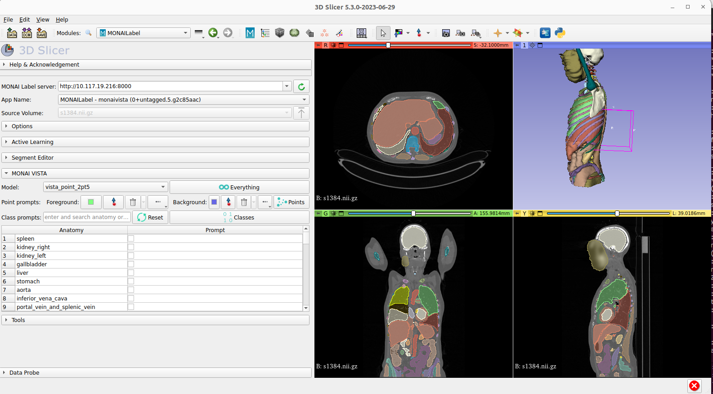
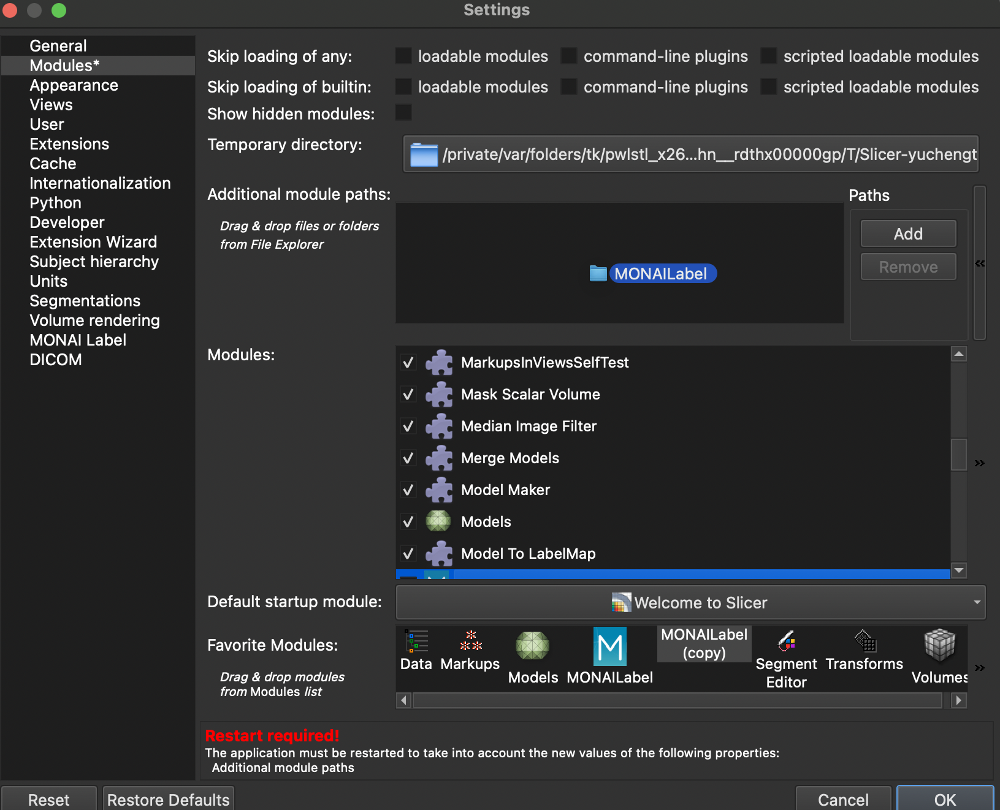
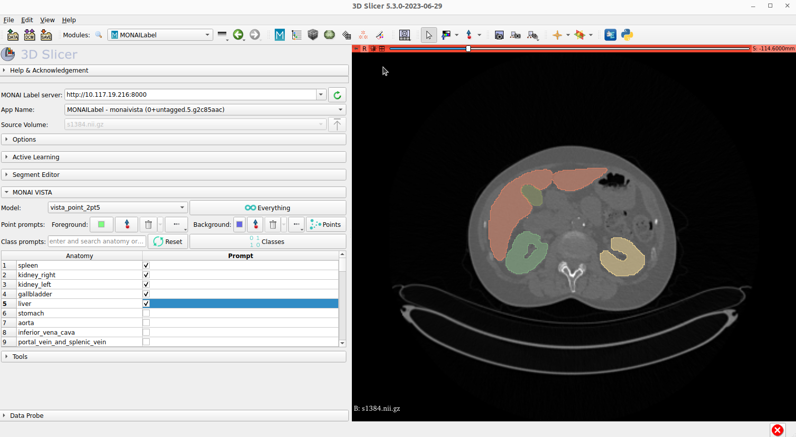

<!--
Copyright (c) MONAI Consortium
Licensed under the Apache License, Version 2.0 (the "License");
you may not use this file except in compliance with the License.
You may obtain a copy of the License at
    http://www.apache.org/licenses/LICENSE-2.0
Unless required by applicable law or agreed to in writing, software
distributed under the License is distributed on an "AS IS" BASIS,
WITHOUT WARRANTIES OR CONDITIONS OF ANY KIND, either express or implied.
See the License for the specific language governing permissions and
limitations under the License.
-->

# MONAI VISTA Models 

<div align="center">  </div>


### Table of Contents
- [Overview](#Overview)
- [Start MONAI VISTA with MONAI Label](#MONAI-Label-Integration)
  - [Step 1. Installation](#Installation)
  - [Step 2. MONAI Label monaivista app](#MONAI-VISTA-APP)
  - [Step 3. MONAI VISTA - Label Plugins](#MONAI-VISTA-Viewer-Plugins)
  - [Step 4. Data Preparation](#Sample-Data)
  - [Step 5. Start MONAI Label Server and Start Annotating!](#Start-MONAI-Label-Server-with-VISTA-Model)
- [Video Demo](#Video-Demo)
- [Contributing](#Contributing)
- [Community](#Community)

## Overview

MONAI VISTA is a plaform solution of deploying medical segmentation foundation models. This section
 provides a MONAI Label integration of APIs and samples apps. The integration is a server-client 
 system that facilitates interactive medical image segmentation using AI models such as segment 
 anything medical model (SAMM) or other prompt-based annotation algorithms. 

MONAI VISTA - MONAI Label integration is an intelligent opem source ecosystem that embables users
to create and deploy vision foundation models especially for medical segmenation. It provides 
interfaces of class- and point-prompts that AI models can take as input. The integration also provides
sample 3D Slicer plugin UIs.

## MONAI Label Integration

### Installation

MONAI VISTA models are integrated based on [MONAI Label](https://docs.monai.io/projects/label/en/latest/index.html#).
Start using MONAI Label locally and run installlation with your familiar visualization tools. 
Stable version software represents the currently tested and supported visualization tools with 
latest release of MONAI Label. Weekly preview version is available if users want the latest feature, 
not fully tested.

Refer to [MONAI Label installation](https://docs.monai.io/projects/label/en/latest/installation.html) page
for details. 

For milestone release, users can install from PyPl with command:

```bash
pip install monailabel

```

For Docker and Github installation, refer to MONAI Label [Github](https://github.com/Project-MONAI/MONAILabel)

### MONAI VISTA APP

Based on MONAI Label, MONAI VISTA is developed as an app. This app has example models 
to do both interactive and "Everything" segmentation over medical images. 
Prompt-based segment experience is highlighted. Including class prompts and point click prompts, 
Segmentation with latest deep learning architectures (e.g., Segmentation Anything Model (SAM)) for multiple lung, abdominal, and pelvis
organs. Interactive tools includes comptrol points, class prompt check boxes are developed with viewer plugins. 

Get the monaivista app with:

```bash
# Clone MONAI VISTA repo
git clone git@github.com:Project-MONAI/VISTA.git
# the sample monaivista app is in the monailabel folder
cd VISTA/monailabel 
```

For more details of `monaivista` app, see the [sample-app page](https://github.com/Project-MONAI/VISTA/tree/add_monailabel_integration/monailabel/monaivista).

### MONAI VISTA Viewer Plugins

The interactive annotation exerprience with prompt-based segmentation models needs integration of medical image viewers. 
MONAI VISTA and MONAI Label support multiple open-sourced viewers, such as [3D Slicer](https://www.slicer.org/) and [OHIF](https://ohif.org/). 

Example of 3D Slicer integration:

3D Slicer is a free, open-source software for visualization, processing, segmentation, registration, 
and other 3D images and meshes. MONAI Label supports 3D Slicer with radiology and monaibundle applications. 
With its advanced features, 3D Slicer is a mature and well-tested viewer for radiology studies and algorithms.

#### Installing 3D Slicer
To use MONAI Label with 3D Slicer, you'll need to download and install 3D Slicer. 
MONAI Label supports stable and preview versions of 3D Slicer, version 5.0 or higher. 
For more information on installing 3D Slicer, 
check out the [3D Slicer Documentation](https://slicer.readthedocs.io/en/latest/user_guide/getting_started.html#installing-3d-slicer)

#### Install MONAI VISTA-Label plugin of 3D Slicer

The plugin needs to be added in developer mode. Please follow following steps.

##### Plugin in Developer Mode

- `git clone git@github.com:Project-MONAI/VISTA.git`
- Find the plugin folder: `plugins/slicer/MONAILabel`
- Open 3D Slicer: Go to **Edit** -> **Application Settings** -> **Modules** -> **Additional Module Paths**
- Add New Module Path: _<FULL_PATH>_/plugins/slicer/MONAILabel (You can drag the slicer/MONAILabel folder to the module panel.)
- _**Restart**_ 3D Slicer

<div align="center">  </div>

<div align="center">  </div>

### Sample Data

Prepare some sample data to start with: 

Download MSD pancreas dataset as the sample dataset using monailabel API. 
The task is the volumetric (3D) segmentation of the pancreas from CT image. 
The dataset is from the 2018 MICCAI challenge.

```bash
monailabel datasets --download --name Task07_Pancreas --output .
```

### Start MONAI Label Server with VISTA Model

Splecify the sample app and sample datasets' path in the following command: 

```bash
monailabel start_server --app monaivista --studies ./Task07_Pancreas/imagesTs --conf models vista_point_2pt5
```

- Open 3D Slicer and MONAI VISTA-Label plugin.
<div align="center">  </div>

- Connect to the monailabel server, start annotating!
<div align="center">  </div>


## Video Demo