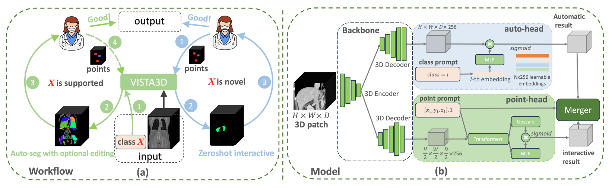
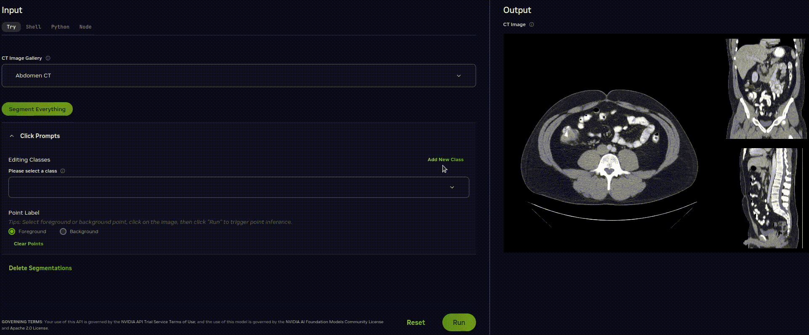
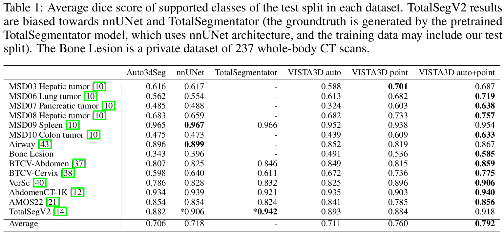
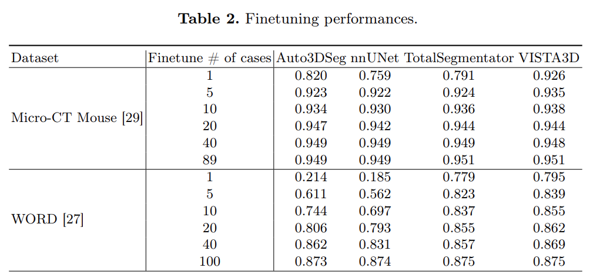

<!--
Copyright (c) MONAI Consortium
Licensed under the Apache License, Version 2.0 (the "License");
you may not use this file except in compliance with the License.
You may obtain a copy of the License at
    http://www.apache.org/licenses/LICENSE-2.0
Unless required by applicable law or agreed to in writing, software
distributed under the License is distributed on an "AS IS" BASIS,
WITHOUT WARRANTIES OR CONDITIONS OF ANY KIND, either express or implied.
See the License for the specific language governing permissions and
limitations under the License.
-->

# MONAI **V**ersatile **I**maging **S**egmen**T**ation and **A**nnotation
[[`Paper`](https://arxiv.org/pdf/2406.05285)] [[`Demo`](https://build.nvidia.com/nvidia/vista-3d)] [[`Checkpoint`]](https://drive.google.com/file/d/1DRYA2-AI-UJ23W1VbjqHsnHENGi0ShUl/view?usp=sharing)
<div align="center">  </div>

## News!
[03/12/2025] We provide VISTA3D as a baseline for the challenge "CVPR 2025: Foundation Models for Interactive 3D Biomedical Image Segmentation"([link](https://www.codabench.org/competitions/5263/)). The simplified code based on MONAI 1.4 is provided in the [here](./cvpr_workshop/).

[02/26/2025] VISTA3D paper has been accepted by **CVPR2025**!
## Overview

The **VISTA3D** is a foundation model trained systematically on 11,454 volumes encompassing 127 types of human anatomical structures and various lesions. It provides accurate out-of-the-box segmentation that matches state-of-the-art supervised models which are trained on each dataset. The model also achieves state-of-the-art zero-shot interactive segmentation in 3D, representing a promising step toward developing a versatile medical image foundation model.


### Out-of box automatic segmentation
For supported 127 classes, the model can perform highly accurate out-of-box segmentation. The fully automated process adopts a patch-based sliding-window inference and only requires a class prompt.
Compared to supervised segmentation models trained on each dataset separately, VISTA3D showed comparable out-of-box performances and strong generalizability ('VISTA3D auto' in Table.1).
<!-- <div align="center">  </div> -->
<div align="center">
<figure>
  
  <figcaption> NIM Demo supports "Segment Everything" </figcaption>
</figure>
</div>


### Interactive editing
The interactive segmentation is based on user-provided clicks. Each click point will impact a local 3D patch. User can either effectively refine the automatic results with clicks ('VISTA3D auto+point' in Table.1) or simply provide a click without specifying the target class ('VISTA3D point' in Table.1) .
<!-- <div align="center">  </div> -->
<div align="center">
<figure>
  
  <figcaption> Specify a supported class and edit the automatic results </figcaption>
</figure>
</div>
<div align="center">
<figure>
  
  <figcaption> Interactive supported class segmentation without specifying class </figcaption>
</figure>
</div>

### Zero-shot interactive segmentation
VISTA3D is built to produce visually plausible segmentations on previously unseen classes.
This capability makes the model even more flexible and accelerates practical segmentation data curation processes.
<div align="center">
<figure>
  
  <figcaption> Add a new unseen class and do annotation </figcaption>
</figure>
</div>


## Usage

## Installation
To perform inference locally with a debugger GUI, simply install
```bash
git clone https://github.com/Project-MONAI/VISTA.git
cd ./VISTA/vista3d
conda create -n -y vista3d python=3.9
conda activate vista3d
pip install -r requirements.txt
```
Download the [model checkpoint](https://drive.google.com/file/d/1DRYA2-AI-UJ23W1VbjqHsnHENGi0ShUl/view?usp=sharing) and save it at ./models/model.pt.

## Inference
The current repo is the research codebase for the CVPR2025 paper, which is built on MONAI1.3.  We converted the model into [MONAI bundle](https://github.com/Project-MONAI/model-zoo/tree/dev/models/vista3d) with improved GPU utilization and speed (the backend for the [demo](https://build.nvidia.com/nvidia/vista-3d)). The automatic segmentation label definition can be found at [label_dict](./data/jsons/label_dict.json). For exact number of supported automatic segmentation class and the reason, please to refer to [issue](https://github.com/Project-MONAI/VISTA/issues/41).
<div align="center">  </div>

### 1. Recommend: MONAI Bundle (model zoo)

```bash
# use the same conda env as this repo
conda activate vista3d
pip install monai==1.4
git clone https://github.com/Project-MONAI/model-zoo.git
mv model-zoo/models/vista3d vista3dbundle & rm -rf model-zoo
cd vista3dbundle
mkdir models
# minor model weights naming conversion due to monai version change
wget -O models/model.pt https://developer.download.nvidia.com/assets/Clara/monai/tutorials/model_zoo/model_vista3d.pt 
```
MONAI bundle accepts multiple json config files and input arguments. The latter configs/arguments will overide the previous configs/arguments if they have overlapping keys. 
```python
# Automatic Segment everything
python -m monai.bundle run --config_file configs/inference.json --input_dict "{'image':'spleen_03.nii.gz'}
```
```python
# Automatic Segment specific class
python -m monai.bundle run --config_file configs/inference.json --input_dict "{'image':'spleen_03.nii.gz','label_prompt':[3]}
```
```python
# Interactive segmentation 
# Points must be three dimensional (x,y,z) in the shape of [[x,y,z],...,[x,y,z]]. Point labels can only be -1(ignore), 0(negative), 1(positive) and 2(negative for special overlaped class like tumor), 3(positive for special class). Only supporting 1 class per inference. The output 255 represents NaN value which means not processed region.
python -m monai.bundle run --config_file configs/inference.json --input_dict "{'image':'spleen_03.nii.gz','points':[[128,128,16], [100,100,16]],'point_labels':[1, 0]}"
```
```python
# Automatic Batch segmentation for the whole folder
python -m monai.bundle run --config_file="['configs/inference.json', 'configs/batch_inference.json']" --input_dir="/data/Task09_Spleen/imagesTr" --output_dir="./eval_task09"
```
```python
# Automatic Batch segmentation for the whole folder with multi-gpu support. mgpu_inference.json is below.
python -m monai.bundle run --config_file="['configs/inference.json', 'configs/batch_inference.json', 'configs/mgpu_inference.json']" --input_dir="/data/Task09_Spleen/imagesTr" --output_dir="./eval_task09"
```
<details>
  <summary><b>Click to see mgpu_inference.json</b></summary>

  ```json
    {
        "device": "$torch.device('cuda:' + os.environ['LOCAL_RANK'])",
        "network": {
            "_target_": "torch.nn.parallel.DistributedDataParallel",
            "module": "$@network_def.to(@device)",
            "device_ids": [
                "@device"
            ]
        },
        "sampler": {
            "_target_": "DistributedSampler",
            "dataset": "@dataset",
            "even_divisible": false,
            "shuffle": false
        },
        "dataloader#sampler": "@sampler",
        "initialize": [
            "$import torch.distributed as dist",
            "$dist.is_initialized() or dist.init_process_group(backend='nccl')",
            "$torch.cuda.set_device(@device)"
        ],
        "run": [
            "$@evaluator.run()"
        ],
        "finalize": [
            "$dist.is_initialized() and dist.destroy_process_group()"
        ]
    }
  ```
</details>

### 1.1 Overlapped classes and postprocessing with [ShapeKit](https://arxiv.org/pdf/2506.24003)
VISTA3D is trained with binary segmentation, and may produce false positives due to weak false positive supervision. ShapeKit solves this problem with sophisticated postprocessing. ShapeKit requires segmentation mask for each class. VISTA3D by default performs argmax and collaps overlapping classes. Change the `monai.apps.vista3d.transforms.VistaPostTransformd` in `inference.json` to save each class segmentation as a separate channel. Then follow [ShapeKit](https://github.com/BodyMaps/ShapeKit) codebase for processing.
```json
{ 
  "_target_": "Activationsd",
  "sigmoid": true,
  "keys": "pred"
},
```

### 2. VISTA3D Research repository (this repo)

We provide the `infer.py` script and its light-weight front-end `debugger.py`. User can directly lauch a local interface for both automatic and interactive segmentation.

```bash
 python -m scripts.debugger run
```
or directly call infer.py to generate automatic segmentation. To segment a liver (label_prompt=1 as defined in [label_dict](./data/jsons/label_dict.json)), run
```bash
export CUDA_VISIBLE_DEVICES=0; python -m scripts.infer --config_file 'configs/infer.yaml' - infer --image_file 'example-1.nii.gz' --label_prompt "[1]" --save_mask true
```
To segment everything, run
```bash
export CUDA_VISIBLE_DEVICES=0; python -m scripts.infer --config_file 'configs/infer.yaml' - infer_everything --image_file 'example-1.nii.gz'
```
To segment based on point clicks, provide `point` and `point_label`. 
```bash
export CUDA_VISIBLE_DEVICES=0; python -m scripts.infer --config_file 'configs/infer.yaml' - infer --image_file 'example-1.nii.gz' --point "[[128,128,16],[100,100,6]]" --point_label "[1,0]" --save_mask true
```
The output path and other configs can be changed in the `configs/infer.yaml`.
```
NOTE: `infer.py`  does not support `lung`, `kidney`, and `bone` class segmentation while MONAI bundle supports those classes. MONAI bundle uses better memory management and will not easily face OOM issue.
```


### Training
#### Dataset and SuperVoxel Curation
All dataset must contain a json data list file. We provide the json lists for all our training data in `data/jsons`. More details can be found [here](./data/README.md). For datasets used in VISTA3D training, we already included the json splits and registered their data specific label index to the global index as [label_mapping](./data/jsons/label_mappings.json) and their data path coded in `./data/datasets.py`. The supported global class index is defined in [label_dict](./data/jsons/label_dict.json). To generate supervoxels, refer to the [instruction](./data/README.md).
#### Execute training
VISTA3D has four stages training. The configurations represents the training procedure but may not fully reproduce the weights of VISTA3D since each stage has multiple rounds with slightly varying configuration changes.
```
export CUDA_VISIBLE_DEVICES=0; python -m scripts.train run --config_file "['configs/train/hyper_parameters_stage1.yaml']"
```

Execute multi-GPU model training (the codebase also supports multi-node training):

```
export CUDA_VISIBLE_DEVICES=0,1,2,3,4,5,6,7;torchrun --nnodes=1 --nproc_per_node=8 -m scripts.train run --config_file "['configs/train/hyper_parameters_stage1.yaml']"
```
### Evaluation
We provide code for supported class fully automatic dice score evaluation (val_multigpu_point_patch), point click only (val_multigpu_point_patch), and auto + point (val_multigpu_autopoint_patch).

```
export CUDA_VISIBLE_DEVICES=0,1,2,3,4,5,6,7;torchrun --nnodes=1 --nproc_per_node=8 -m scripts.validation.val_multigpu_point_patch run --config_file "['configs/supported_eval/infer_patch_auto.yaml']" --dataset_name 'xxxx'

export CUDA_VISIBLE_DEVICES=0,1,2,3,4,5,6,7;torchrun --nnodes=1 --nproc_per_node=8 -m scripts.validation.val_multigpu_point_patch run --config_file "['configs/supported_eval/infer_patch_point.yaml']" --dataset_name 'xxxx'

export CUDA_VISIBLE_DEVICES=0,1,2,3,4,5,6,7;torchrun --nnodes=1 --nproc_per_node=8 -m scripts.validation.val_multigpu_autopoint_patch run --config_file "['configs/supported_eval/infer_patch_autopoint.yaml']" --dataset_name 'xxxx'
```
For zero-shot, we perform iterative point sampling. To create a new zero-shot evaluation dataset, user only need to change `label_set` in the json config to match the class indexes in the original groundtruth.
```
export CUDA_VISIBLE_DEVICES=0,1,2,3,4,5,6,7;torchrun --nnodes=1 --nproc_per_node=8 -m scripts.validation.val_multigpu_point_iterative run --config_file "['configs/zeroshot_eval/infer_iter_point_hcc.yaml']"
```
### Finetune
VISTA3D checkpoint showed improvements when finetuning in few-shot settings. Once a few annotated examples are provided, user can start finetune with the VISTA3D checkpoint.
<div align="center">  </div>
For finetuning, user need to change `label_set` and `mapped_label_set` in the json config, where `label_set` matches the index values in the groundtruth files. The `mapped_label_set` can be random selected but we recommend pick the most related global index defined in [label_dict](./data/jsons/label_dict.json). User should modify the transforms, resolutions, patch sizes e.t.c regarding to their dataset for optimal finetuning performances, we recommend using configs generated by auto3dseg. The learning rate 5e-5 should be good enough for finetuning purposes.
```
export CUDA_VISIBLE_DEVICES=0,1,2,3,4,5,6,7;torchrun --nnodes=1 --nproc_per_node=8 -m scripts.train_finetune run --config_file "['configs/finetune/train_finetune_word.yaml']"
```

```
Note: MONAI bundle also provides a unified API for finetuning, but the results in the table and paper are from this research repository.
```


## Community

Join the conversation on Twitter [@ProjectMONAI](https://twitter.com/ProjectMONAI) or join
our [Slack channel](https://projectmonai.slack.com/archives/C031QRE0M1C).

Ask and answer questions on [MONAI VISTA's GitHub discussions tab](https://github.com/Project-MONAI/VISTA/discussions).

## License

The codebase is under Apache 2.0 Licence. The model weight is released under [NVIDIA OneWay Noncommercial License](./NVIDIA%20OneWay%20Noncommercial%20License.txt).

## Reference

```
@article{he2024vista3d,
  title={VISTA3D: A Unified Segmentation Foundation Model For 3D Medical Imaging},
  author={He, Yufan and Guo, Pengfei and Tang, Yucheng and Myronenko, Andriy and Nath, Vishwesh and Xu, Ziyue and Yang, Dong and Zhao, Can and Simon, Benjamin and Belue, Mason and others},
  journal={CVPR},
  year={2025}
}
```

## Acknowledgement
- [segment-anything](https://github.com/facebookresearch/segment-anything)
- [TotalSegmentator](https://github.com/wasserth/TotalSegmentator)
