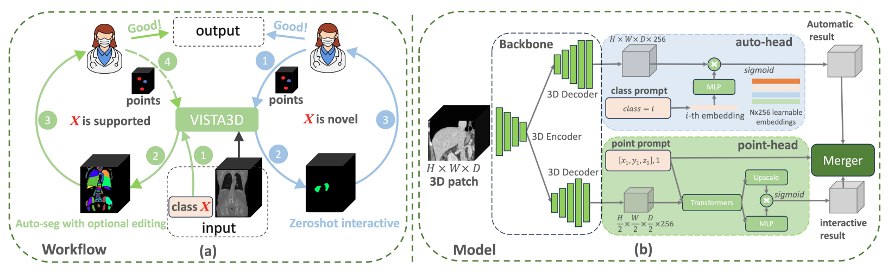
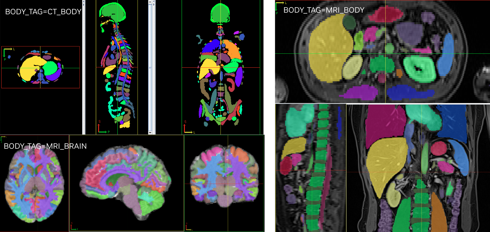
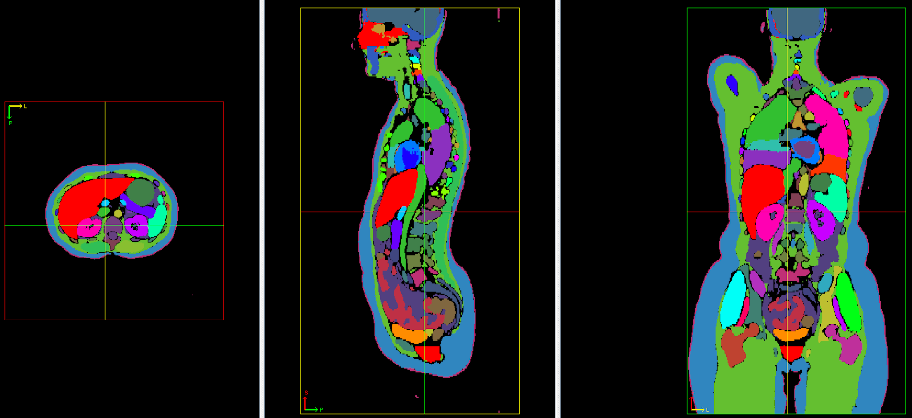
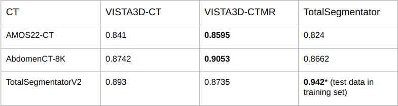
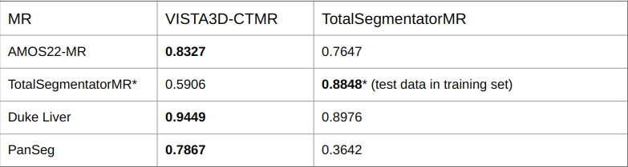

<!--
Copyright (c) MONAI Consortium
Licensed under the Apache License, Version 2.0 (the "License");
you may not use this file except in compliance with the License.
You may obtain a copy of the License at
    http://www.apache.org/licenses/LICENSE-2.0
Unless required by applicable law or agreed to in writing, software
distributed under the License is distributed on an "AS IS" BASIS,
WITHOUT WARRANTIES OR CONDITIONS OF ANY KIND, either express or implied.
See the License for the specific language governing permissions and
limitations under the License.
-->

# MONAI **V**ersatile **I**maging **S**egmen**T**ation and **A**nnotation
[[`Paper`](https://arxiv.org/pdf/2406.05285)] [[`Demo`](https://build.nvidia.com/nvidia/vista-3d)] [[`Huggingface`]](https://huggingface.co/nvidia/NV-Segment-CT)
[[`Huggingface-CTMR`]](https://huggingface.co/nvidia/NV-Segment-CTMR)

<div align="center">  </div>

## News!
[10/27/2025] We release NV-Segment-CTMR, a joint CT-MR automatic segmentation model trained on over 30K CT and MRI scans, supporting over 300 classes. 

[03/12/2025] We provide VISTA3D as a baseline for the challenge "CVPR 2025: Foundation Models for Interactive 3D Biomedical Image Segmentation"([link](https://www.codabench.org/competitions/5263/)). The simplified code based on MONAI 1.4 is provided in the [here](./cvpr_workshop/).

[02/26/2025] VISTA3D paper has been accepted by **CVPR2025**!

## Overview

## Model Comparison


| Feature | VISTA3D | NV-Segment-CT | NV-Segment-CTMR |
|---------|---------------|-----------------|---------------|
| **Anatomical Classes** | [132 classes (7 types of tumors)](data/jsons/label_dict.json) | Same as VISTA3D | [345+ classes](https://github.com/NVIDIA-Medtech/NV-Segment-CTMR/blob/main/NV-Segment-CTMR/configs/metadata.json) [Details](https://github.com/NVIDIA-Medtech/NV-Segment-CTMR/blob/main/NV-Segment-CTMR/configs/label_dict.json) |
| **Modalities** | CT only | Same as VISTA3D |  CT + MRI (body & brain) |
| **Segmentation Type** |  Automatic + Interactive (point-click) | Same as VISTA3D | Automatic only |
| **Model Weights**    | [NV-Segment-CT on HuggingFace (MONAI 1.3)](https://huggingface.co/nvidia/NV-Segment-CT) |  [NV-Segment-CT on HuggingFace (MONAI1.4, minor layer naming change)](https://huggingface.co/nvidia/NV-Segment-CT) | [NV-Segment-CTMR on HuggingFace](https://huggingface.co/nvidia/NV-Segment-CTMR) |
| **Implementation**| Current Repo: MONAI1.3 research code | Optimized MONAI Bundle (MONAI>=1.4) | Optimized MONAI Bundle (MONAI>=1.4) |
| **Usage**| Full training for all models, inference and finetune | Optimized and fast inference. Light weight finetune. Wrapped into config and bundle | Same as NV-Segment-CT |
| **License**     | [Commercial Friendly](https://www.nvidia.com/en-us/agreements/enterprise-software/nvidia-open-model-license/) | Same as VISTA3D | [Non-Commercial](https://developer.download.nvidia.com/licenses/NVIDIA-OneWay-Noncommercial-License-22Mar2022.pdf?t=eyJscyI6InJlZiIsImxzZCI6IlJFRi1naXRodWIuY29tL252aWRpYS1ob2xvc2NhbiJ9) |

```
We recommend users to use NV-Segment-CTMR for large scale automatic segmentation for CT and MRI scans because it is trained with large and diverse datasets. For CT tumor or interactive refinement, user should try NV-Segment-CT. 
``` 

**VISTA3D/NV-Segment-CT** ([`Paper`](https://arxiv.org/pdf/2406.05285)) is a foundation model trained systematically on 11,454 volumes encompassing 127 types of human anatomical structures and various lesions. The model provides State-of-the-art performances on:

- out-of-the-box automatic segmentation on 3D CT scans
- zero-shot interactive segmentation in 3D CT scans
- automatic segemntation + interactive refinement

**NV-Segment-CTMR** starts from NV-Segment-CT checkpoint and finetuned on over 30K CT and MRI scans, supporting over 300 classes.

- out-of-the-box automatic segmentation on 3D CT scans
- share the same architecture with VISTA3D-CT model but we only trained the automatic segmentation branch with larger CT and MRI datasets.

<div align="center">  </div>


<div align="center">  </div>

## Usage
## 1. NVIDIA Open Models and HuggingFace
We wrapped VISTA3D-CT and VISTA3D-CTMR into a more structured MONAI bundle format with optimized GPU utilization and better interface for training and inference, meanwhile, we created simplified Huggingface models for inference. We will only maintain directories in the following repository:

### Quick Start
#### Installation
```bash
# use the same conda env as this repo
conda create -y -n vista3d-nv python=3.9
conda activate vista3d-nv
git clone https://github.com/NVIDIA-Medtech/NV-Segment-CTMR.git
cd NV-Segment-CTMR/NV-Segment-CTMR;
pip install -r requirements.txt;
cd ..;
mkdir NV-Segment-CT/models;mkdir NV-Segment-CTMR/models
# download from huggingface link for CT
hf download nvidia/NV-Segment-CT vista3d_pretrained_model/model.pt --local-dir NV-Segment-CT/models/ && \
mv NV-Segment-CT/models/vista3d_pretrained_model/model.pt NV-Segment-CT/models/model.pt && \
rmdir NV-Segment-CT/models/vista3d_pretrained_model
# download from huggingface link for CTMR
hf download nvidia/NV-Segment-CTMR vista3d_pretrained_model/model.pt --local-dir NV-Segment-CTMR/models/ && \
mv NV-Segment-CTMR/models/vista3d_pretrained_model/model.pt NV-Segment-CTMR/models/model.pt && \
rmdir NV-Segment-CTMR/models/vista3d_pretrained_model
```

## 1.1 **NV-Segment-CT**[[Github]](https://github.com/NVIDIA-Medtech/NV-Segment-CTMR/tree/main/NV-Segment-CT)[[Huggingface]](https://huggingface.co/nvidia/NV-Segment-CT)

#### Automatic Segmentation (support multi-gpu batch processing)
[class definition](https://github.com/NVIDIA-Medtech/NV-Segment-CTMR/blob/main/NV-Segment-CT/configs/label_dict.json)
```bash
# CT sementation
cd NV-Segment-CT
# Automatic Segment everything
python -m monai.bundle run --config_file configs/inference.json --input_dict "{'image':'example/spleen_03.nii.gz'}"
# Automatic Segment specific class
python -m monai.bundle run --config_file configs/inference.json --input_dict "{'image':'example/spleen_03.nii.gz','label_prompt':[3]}"
# Automatic Batch segmentation for the whole folder
python -m monai.bundle run --config_file="['configs/inference.json', 'configs/batch_inference.json']" --input_dir="example/" --output_dir="example/"
# Automatic Batch segmentation for the whole folder with multi-gpu support. mgpu_inference.json is below. change nproc_per_node to your GPU number.
torchrun --nproc_per_node=2 --nnodes=1 -m monai.bundle run --config_file="['configs/inference.json', 'configs/batch_inference.json', 'configs/mgpu_inference.json']" --input_dir="example/" --output_dir="example/"
```
#### Interactive segmentation 
```bash
# Points must be three dimensional (x,y,z) in the shape of [[x,y,z],...,[x,y,z]]. Point labels can only be -1(ignore), 0(negative), 1(positive) and 2(negative for special overlaped class like tumor), 3(positive for special class). Only supporting 1 class per inference. The output 255 represents NaN value which means not processed region.
cd NV-Segment-CT
python -m monai.bundle run --config_file configs/inference.json --input_dict "{'image':'example/spleen_03.nii.gz','points':[[128,128,16], [100,100,16]],'point_labels':[1, 0]}"
```
**NOTE** MONAI bundle accepts multiple json config files and input arguments. The latter configs/arguments will overide the previous configs/arguments if they have overlapping keys. 


## 1.2 **NV-Segment-CTMR**[[Github]](https://github.com/NVIDIA-Medtech/NV-Segment-CTMR/tree/main/NV-Segment-CTMR)[[Huggingface]](https://huggingface.co/nvidia/NV-Segment-CTMR/tree/main)
Please read the complete usage in the NV-Segment-CTMR [[Github]](https://github.com/NVIDIA-Medtech/NV-Segment-CTMR/tree/main/NV-Segment-CTMR) repo. 

We defined 345 classes as in [metadata.json](https://github.com/NVIDIA-Medtech/NV-Segment-CTMR/blob/main/NV-Segment-CTMR/configs/metadata.json) and details in [label_dict.json](https://github.com/NVIDIA-Medtech/NV-Segment-CTMR/blob/main/NV-Segment-CTMR/configs/label_dict.json). It shows the label organ name, index, training dataset, modality and evaluation dice score. If a class only comes from CT training dataset, it may not perform well on MRI, but the actual performance will vary case by case. We support three type of segment everything "CT_BODY", "MRI_BODY", and "MRI_BRAIN". 

- "CT_BODY" is the previous VISTA3D bundle supported 132 CT classes. Same as NV-Segment-CT everything prompts. 
- "MRI_BODY" shares the same 50 label class as TotalsegmentatorMR. 
- "MRI_BRAIN" is trained on skull stripped [LUMIR](https://github.com/JHU-MedImage-Reg/LUMIR_L2R) dataset and will segment 133 brain MRI substructures.  We followed [MIR Preprocessing](https://github.com/junyuchen245/MIR/tree/main/tutorials/brain_MRI_preprocessing) tutorials and put the corresponding components into this repo. `All contrasts of brain MRI are supported`

### Quick Start
#### Automatic Segmentation (support multi-gpu batch processing)
[class definition](https://github.com/NVIDIA-Medtech/NV-Segment-CTMR/blob/main/NV-Segment-CTMR/configs/label_dict.json)

```bash
# navigate into CTMR folder.
cd NV-Segment-CTMR;
# Automatic Segment everything. It requires a modality key. We allow "CT_BODY", "MRI_BODY", and "MRI_BRAIN". If modality key is not provided, CT_BODY is used as default. For brain, we require preprocessing.
python -m monai.bundle run --config_file configs/inference.json --input_dict "{'image':'example/s0289.nii.gz'}" --modality MRI_BODY
# Automatic Segment specific class
python -m monai.bundle run --config_file configs/inference.json --input_dict "{'image':'example/s0289.nii.gz','label_prompt':[3]}"
# Automatic Batch segmentation for the whole folder
python -m monai.bundle run --config_file="['configs/inference.json', 'configs/batch_inference.json']" --input_dir="example/" --output_dir="example/" --modality MRI_BODY
# Automatic Batch segmentation for the whole folder with multi-gpu support. mgpu_inference.json is below. change nproc_per_node to your GPU number.
torchrun --nproc_per_node=2 --nnodes=1 -m monai.bundle run --config_file="['configs/inference.json', 'configs/batch_inference.json', 'configs/mgpu_inference.json']" --input_dir="example/" --output_dir="example/" --modality MRI_BODY
```

#### Brain MRI segmentation
For brain MRI segmentation, skull stripping, bias correction and MNI space alignment is included in the codebase. Skull stripping requires docker enviroments. More details can be found in run_brain_segmentation.sh.
```bash
./brain_t1_preprocess/run_brain_segmentation.sh --input example/brain_t1.nii.gz --output_dir results/
```

## 2. CVPR2025 research repo (current codebase, CT only)
This research repo is for reproducing results for the CVPR2025 [paper](https://arxiv.org/pdf/2406.05285) with all the model training and evaluation code, built upon MONAI1.3. We will not update this repo in the future. See [details](./README_research.md)


## 3. VISTA3D results postprocessing with [ShapeKit](https://arxiv.org/pdf/2506.24003)
VISTA3D is trained with binary segmentation, and may produce false positives due to weak false positive supervision. ShapeKit solves this problem with sophisticated postprocessing. ShapeKit requires segmentation mask for each class. VISTA3D by default performs argmax and collaps overlapping classes. Change the `monai.apps.vista3d.transforms.VistaPostTransformd` in `inference.json` to save each class segmentation as a separate channel. Then follow [ShapeKit](https://github.com/BodyMaps/ShapeKit) codebase for processing.
```json
{ 
  "_target_": "Activationsd",
  "sigmoid": true,
  "keys": "pred"
},
```
## Community

Join the conversation on Twitter [@ProjectMONAI](https://twitter.com/ProjectMONAI) or join
our [Slack channel](https://projectmonai.slack.com/archives/C031QRE0M1C).

Ask and answer questions on [MONAI VISTA's GitHub discussions tab](https://github.com/Project-MONAI/VISTA/discussions).

## License

The codebase is under Apache 2.0 Licence. The model weight is released under [NVIDIA OneWay Noncommercial License](./NVIDIA%20OneWay%20Noncommercial%20License.txt).

## Reference

```
@article{he2024vista3d,
  title={VISTA3D: A Unified Segmentation Foundation Model For 3D Medical Imaging},
  author={He, Yufan and Guo, Pengfei and Tang, Yucheng and Myronenko, Andriy and Nath, Vishwesh and Xu, Ziyue and Yang, Dong and Zhao, Can and Simon, Benjamin and Belue, Mason and others},
  journal={CVPR},
  year={2025}
}
```

## Acknowledgement
- [segment-anything](https://github.com/facebookresearch/segment-anything)
- [TotalSegmentator](https://github.com/wasserth/TotalSegmentator)
