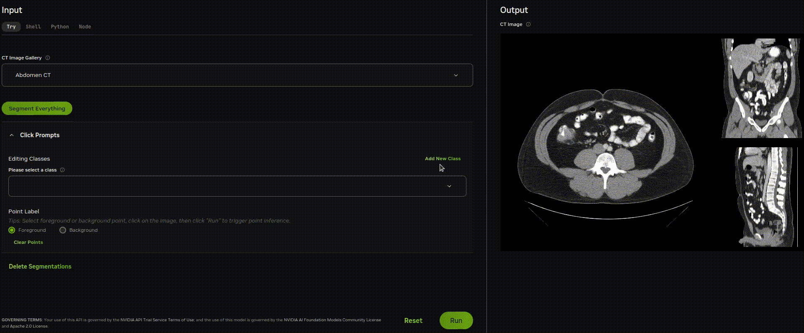
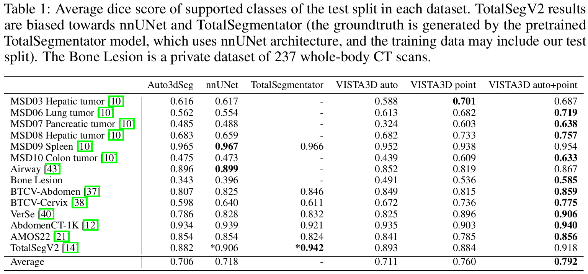
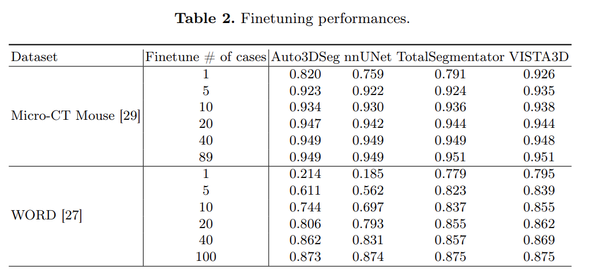

## Overview

The **VISTA3D** is a foundation model trained systematically on 11,454 volumes encompassing 127 types of human anatomical structures and various lesions. It provides accurate out-of-the-box segmentation that matches state-of-the-art supervised models which are trained on each dataset. The model also achieves state-of-the-art zero-shot interactive segmentation in 3D, representing a promising step toward developing a versatile medical image foundation model.


### Out-of box automatic segmentation
For supported 127 classes, the model can perform highly accurate out-of-box segmentation. The fully automated process adopts a patch-based sliding-window inference and only requires a class prompt.
Compared to supervised segmentation models trained on each dataset separately, VISTA3D showed comparable out-of-box performances and strong generalizability ('VISTA3D auto' in Table.1).
<!-- <div align="center">  </div> -->
<div align="center">
<figure>
  
  <figcaption> NIM Demo supports "Segment Everything" </figcaption>
</figure>
</div>


### Interactive editing
The interactive segmentation is based on user-provided clicks. Each click point will impact a local 3D patch. User can either effectively refine the automatic results with clicks ('VISTA3D auto+point' in Table.1) or simply provide a click without specifying the target class ('VISTA3D point' in Table.1) .
<!-- <div align="center">  </div> -->
<div align="center">
<figure>
  
  <figcaption> Specify a supported class and edit the automatic results </figcaption>
</figure>
</div>
<div align="center">
<figure>
  
  <figcaption> Interactive supported class segmentation without specifying class </figcaption>
</figure>
</div>

### Zero-shot interactive segmentation
VISTA3D is built to produce visually plausible segmentations on previously unseen classes.
This capability makes the model even more flexible and accelerates practical segmentation data curation processes.
<div align="center">
<figure>
  
  <figcaption> Add a new unseen class and do annotation </figcaption>
</figure>
</div>


## Installation
To perform inference locally with a debugger GUI, simply install
```bash
git clone https://github.com/Project-MONAI/VISTA.git
cd ./VISTA/vista3d
conda create -y -n vista3d python=3.9
conda activate vista3d
pip install -r requirements.txt
mkdir models
hf download nvidia/NV-Segment-CT --local-dir models/ && \
mv models/vista3d_pretrained_model/model_monai1.3.pt models/model.pt
```
The researh repo ussed monai1.3 checkpoint while NVSegment-CTMR used monai1.4, which has subtle layer naming difference.

## Inferencce

The current repo is the research codebase for the CVPR2025 paper, which is built on MONAI1.3.  We converted the model into [MONAI bundle](https://github.com/Project-MONAI/model-zoo/tree/dev/models/vista3d) with improved GPU utilization and speed (the backend for the [demo](https://build.nvidia.com/nvidia/vista-3d)). The automatic segmentation label definition can be found at [label_dict](./data/jsons/label_dict.json). For exact number of supported automatic segmentation class and the reason, please to refer to [issue](https://github.com/Project-MONAI/VISTA/issues/41).
<div align="center">  </div>

We provide the `infer.py` script and its light-weight front-end `debugger.py`. User can directly lauch a local interface for both automatic and interactive segmentation.

```bash
 python -m scripts.debugger run
```
or directly call infer.py to generate automatic segmentation. To segment a liver (label_prompt=1 as defined in [label_dict](./data/jsons/label_dict.json)), run
```bash
export CUDA_VISIBLE_DEVICES=0; python -m scripts.infer --config_file 'configs/infer.yaml' - infer --image_file 'example-1.nii.gz' --label_prompt "[1]" --save_mask true
```
To segment everything, run
```bash
export CUDA_VISIBLE_DEVICES=0; python -m scripts.infer --config_file 'configs/infer.yaml' - infer_everything --image_file 'example-1.nii.gz'
```
To segment based on point clicks, provide `point` and `point_label`. 
```bash
export CUDA_VISIBLE_DEVICES=0; python -m scripts.infer --config_file 'configs/infer.yaml' - infer --image_file 'example-1.nii.gz' --point "[[128,128,16],[100,100,6]]" --point_label "[1,0]" --save_mask true
```
The output path and other configs can be changed in the `configs/infer.yaml`.
```
NOTE: `infer.py`  does not support `lung`, `kidney`, and `bone` class segmentation while MONAI bundle supports those classes. MONAI bundle uses better memory management and will not easily face OOM issue.
```
### Training
#### Dataset and SuperVoxel Curation
All dataset must contain a json data list file. We provide the json lists for all our training data in `data/jsons`. More details can be found [here](./data/README.md). For datasets used in VISTA3D training, we already included the json splits and registered their data specific label index to the global index as [label_mapping](./data/jsons/label_mappings.json) and their data path coded in `./data/datasets.py`. The supported global class index is defined in [label_dict](./data/jsons/label_dict.json). To generate supervoxels, refer to the [instruction](./data/README.md).
#### Execute training
VISTA3D has four stages training. The configurations represents the training procedure but may not fully reproduce the weights of VISTA3D since each stage has multiple rounds with slightly varying configuration changes.
```
export CUDA_VISIBLE_DEVICES=0; python -m scripts.train run --config_file "['configs/train/hyper_parameters_stage1.yaml']"
```

Execute multi-GPU model training (the codebase also supports multi-node training):

```
export CUDA_VISIBLE_DEVICES=0,1,2,3,4,5,6,7;torchrun --nnodes=1 --nproc_per_node=8 -m scripts.train run --config_file "['configs/train/hyper_parameters_stage1.yaml']"
```
### Evaluation
We provide code for supported class fully automatic dice score evaluation (val_multigpu_point_patch), point click only (val_multigpu_point_patch), and auto + point (val_multigpu_autopoint_patch).

```
export CUDA_VISIBLE_DEVICES=0,1,2,3,4,5,6,7;torchrun --nnodes=1 --nproc_per_node=8 -m scripts.validation.val_multigpu_point_patch run --config_file "['configs/supported_eval/infer_patch_auto.yaml']" --dataset_name 'xxxx'

export CUDA_VISIBLE_DEVICES=0,1,2,3,4,5,6,7;torchrun --nnodes=1 --nproc_per_node=8 -m scripts.validation.val_multigpu_point_patch run --config_file "['configs/supported_eval/infer_patch_point.yaml']" --dataset_name 'xxxx'

export CUDA_VISIBLE_DEVICES=0,1,2,3,4,5,6,7;torchrun --nnodes=1 --nproc_per_node=8 -m scripts.validation.val_multigpu_autopoint_patch run --config_file "['configs/supported_eval/infer_patch_autopoint.yaml']" --dataset_name 'xxxx'
```
For zero-shot, we perform iterative point sampling. To create a new zero-shot evaluation dataset, user only need to change `label_set` in the json config to match the class indexes in the original groundtruth.
```
export CUDA_VISIBLE_DEVICES=0,1,2,3,4,5,6,7;torchrun --nnodes=1 --nproc_per_node=8 -m scripts.validation.val_multigpu_point_iterative run --config_file "['configs/zeroshot_eval/infer_iter_point_hcc.yaml']"
```
### Finetune
VISTA3D checkpoint showed improvements when finetuning in few-shot settings. Once a few annotated examples are provided, user can start finetune with the VISTA3D checkpoint.
<div align="center">  </div>
For finetuning, user need to change `label_set` and `mapped_label_set` in the json config, where `label_set` matches the index values in the groundtruth files. The `mapped_label_set` can be random selected but we recommend pick the most related global index defined in [label_dict](./data/jsons/label_dict.json). User should modify the transforms, resolutions, patch sizes e.t.c regarding to their dataset for optimal finetuning performances, we recommend using configs generated by auto3dseg. The learning rate 5e-5 should be good enough for finetuning purposes.
```
export CUDA_VISIBLE_DEVICES=0,1,2,3,4,5,6,7;torchrun --nnodes=1 --nproc_per_node=8 -m scripts.train_finetune run --config_file "['configs/finetune/train_finetune_word.yaml']"
```

```
Note: MONAI bundle also provides a unified API for finetuning, but the results in the table and paper are from this research repository.
```
